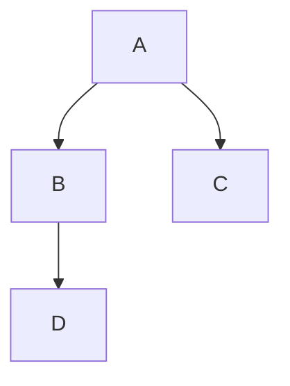

# Zenn Article Writing Skill

このスキルは Zenn プラットフォームで技術記事を作成する際のガイドラインと記法を提供します。

## フロントマター仕様

すべての記事は以下のフロントマターで始まる必要があります。

```yaml
---
title: "記事のタイトル（60文字以内推奨）"
emoji: "🎯" # 記事のアイコン（絵文字1文字）
type: "tech" # tech: 技術記事 / idea: アイデア記事
topics: ["vue", "typescript"] # タグ（最大5個、小文字英数字とハイフンのみ）
published: false # true: 公開 / false: 下書き
---
```

### フロントマターのルール

- title は必須で、記事のタイトルを指定する
- emoji は必須で、絵文字 1 文字のみ指定する
- type は必須で、"tech" または "idea" を指定する
- topics は必須で、最大 5 個まで。小文字英数字とハイフン（-）のみ使用可能
- published は必須で、true で公開、false で下書きになる

## 記事構成の推奨パターン

```markdown
## はじめに

ナイトウ([@naitokosuke](https://twitter.com/naitokosuke))と申します。

（導入文・記事の概要）

## （メインコンテンツのセクション）

...

## まとめ

（記事の要点をまとめる）

## 参考リンク

- [タイトル](URL)

## 最後に

最後まで読んでいただきありがとうございました！
```

## Zenn Flavored Markdown 記法

### 1. 基本的な Markdown

- 見出しは `##` から `####` まで（h2〜h4）を使用する。アクセシビリティのため h2 から開始を推奨
- リストは `-` または `*` で箇条書き、`1.` `2.` で番号付きリストを作成する
- リンクは `[テキスト](URL)` の形式で記述する
- 画像は `` の形式で記述する
- 太字は `**テキスト**` で記述する
- イタリックは `*テキスト*` で記述する
- 打ち消し線は `~~テキスト~~` で記述する
- インラインコードは `` `code` `` で記述する

### 2. 画像の詳細設定

```markdown
# 幅を指定（ピクセル）


# 画像にリンクを設定

[](link-URL)

# プロジェクト内の画像（images/ ディレクトリ）


```

### 3. コードブロック

````markdown
```javascript:ファイル名
const hello = "world";
```
````

- Prism.js によるシンタックスハイライト対応
- `:ファイル名` でファイル名を表示可能

### 4. メッセージブロック（Zenn 独自）

```markdown
:::message
通常のメッセージ
:::

:::message alert
警告メッセージ
:::
```

### 5. アコーディオン（詳細表示）（Zenn 独自）

```markdown
:::details タイトル
折りたたまれる内容
:::

# ネストする場合はコロンを増やす

::::details 外側
:::message
内側のメッセージ
:::
::::
```

### 6. 数式表示（KaTeX）

```markdown
# ブロック数式

$$
e^{i\pi} + 1 = 0
$$

# インライン数式

$a \ne 0$
```

### 7. ダイアグラム（Mermaid）

````markdown

````

- フローチャート、シーケンス図、クラス図などに対応

### 8. コンテンツ埋め込み（Zenn 独自）

#### 自動埋め込み（URL を単独行に記載）

```markdown
# リンクカード

https://example.com

# YouTube

https://www.youtube.com/watch?v=xxxxx

# Twitter/X

https://twitter.com/user/status/xxxxx

# GitHub（特定行の指定も可能）

https://github.com/user/repo/blob/main/file.js#L10-L20
```

#### 手動埋め込み（@[service](URL) 形式）

```markdown
@[youtube](https://www.youtube.com/watch?v=xxxxx)
@[twitter](https://twitter.com/user/status/xxxxx)
@[codepen](https://codepen.io/user/pen/xxxxx)
@[jsfiddle](https://jsfiddle.net/user/xxxxx/)
@[codesandbox](https://codesandbox.io/s/xxxxx)
@[stackblitz](https://stackblitz.com/edit/xxxxx)
@[figma](https://www.figma.com/file/xxxxx)
@[speakerdeck](https://speakerdeck.com/user/xxxxx)
@[slideshare](https://www.slideshare.net/user/xxxxx)
@[docswell](https://www.docswell.com/s/user/xxxxx)
@[gist](https://gist.github.com/user/xxxxx)
```

URL にアンダースコア（`_`）が含まれる場合、自動検出されないことがあります。その場合は以下の方法を使用してください。

```markdown
# 方法 1: card 指定

@[card](https://example.com/path_with_underscore)

# 方法 2: 山括弧

<https://example.com/path_with_underscore>
```

## 文体ルール（textlint 対応）

このリポジトリでは textlint によるルールが設定されています。

1. 本文は「ですます」調で統一する
2. 箇条書きは「である」調で統一する
3. 文末に必ず句点（。）を付ける
4. `**タイトル**: 説明` のような機械的な形式は避け、自然な文体にする

## 画像の配置

記事に画像を使用する場合は以下の手順に従います。

1. `images/記事のslug/` ディレクトリに画像を配置
2. 記事内では `/images/記事のslug/画像名.png` のように参照

```markdown

```

## よく使うトピック例

- フロントエンド: `vue`, `vuejs`, `nuxt`, `typescript`, `javascript`
- フレームワーク: `nextjs`, `nuxtjs`
- スタイリング: `css`, `tailwindcss`, `unocss`, `sass`
- ツール: `vite`, `webpack`, `eslint`, `prettier`
- バックエンド: `nodejs`, `python`, `go`, `rust`
- その他: `git`, `github`, `vscode`, `docker`

## 記事作成時のチェックリスト

- [ ] フロントマターが正しく設定されているか
- [ ] title は 60 文字以内か
- [ ] topics は 5 個以内で、小文字英数字とハイフンのみか
- [ ] 本文は「ですます」調で統一されているか
- [ ] 箇条書きは「である」調で統一されているか
- [ ] コードブロックに言語指定があるか
- [ ] 画像のパスは正しいか
- [ ] textlint エラーがないか

## 記事公開までの流れ

1. `npx zenn new:article` で記事を作成（または手動作成）
2. フロントマターで `published: false` に設定
3. 記事を執筆
4. `npx textlint articles/ファイル名.md` で lint チェック
5. `npx zenn preview` でローカルプレビュー（http://localhost:8000 で確認）
6. 問題なければ `published: true` に変更
7. main ブランチに push すると自動的に Zenn に公開される
